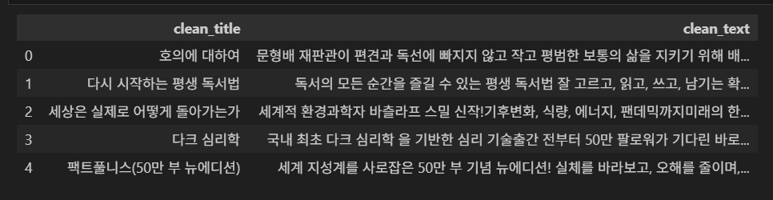

# 📖 책 소개가 너무 길다... 요약을 요약 📚

<br>

### 1. 주제
교보문고 베스트셀러 중 국내도서 Top20 도서들의 소개글 요약하기

<br>

### 2. 주제 선정 이유
평소에 다음으로 읽거나 구매할 책을 고를 때 교보문고 베스트셀러를 주로 참고한다. <br>
흥미로워 보이는 제목의 책이 있으면 책 소개를 읽어보고 고르는데, 숏폼 시대에 이 책 소개마저도 너무 길다는 생각이 종종 들었다. <br>
그래서 책 소개를 요약하기로 했다. 책 소개가 이미 책을 요약한 것이니, 어찌보면 요약을 요약하는 것이다! 😉

<br>

### 3. NLP Task
**Summarization** 이고, `EbanLee/kobart-summary-v3` 모델을 사용했다. <br>
출처 : https://huggingface.co/EbanLee/kobart-summary-v3?library=transformers

<br>

### 4. 데이터셋 정제 및 준비
교보문고 베스트셀러 페이지에서 일간, 국내도서를 선택하여 (https://store.kyobobook.co.kr/bestseller/online/daily/domestic?page=1) <br>
첫 페이지의 20권 각각의 책 소개글을 가져오도록 크롤링하였습니다. `kyobo_books.csv` <br>
이후 아래의 과정을 거쳐 정제 해 주었습니다. `kyobo_books_cleaned.csv`
```
def clean_text(text):
    text = re.sub(r"<.*?>", " ", text)  # HTML 태그 제거
    text = re.sub(r"[★☆※♣♠♥♦●○◎◇◆■□▲▼▶▷◀◁『』《》“”‘’\"\'\U00010000-\U0010ffff]", " ", text)  # 특수문자/이모지 제거
    noise = [
        r"교보문고\s*",
        r"바로드림\s*",
        r"예약판매\s*",
        r"구매혜택.*",
    ]
    for p in noise:
        text = re.sub(p, " ", text)
    text = re.sub(r"\s+", " ", text).strip()  # 공백
    return text
```


**전이학습도 하고싶어서 진행중이라 추가 예정입니당**

